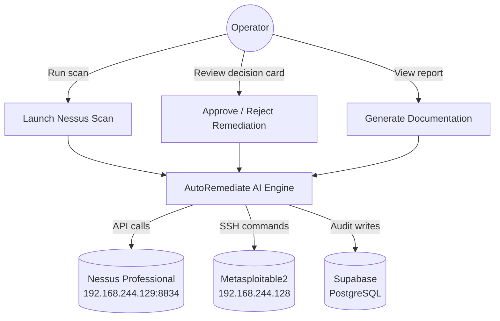
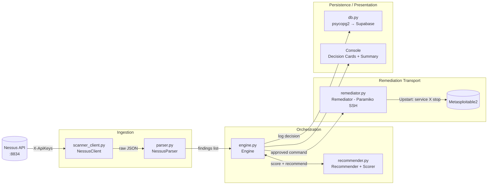
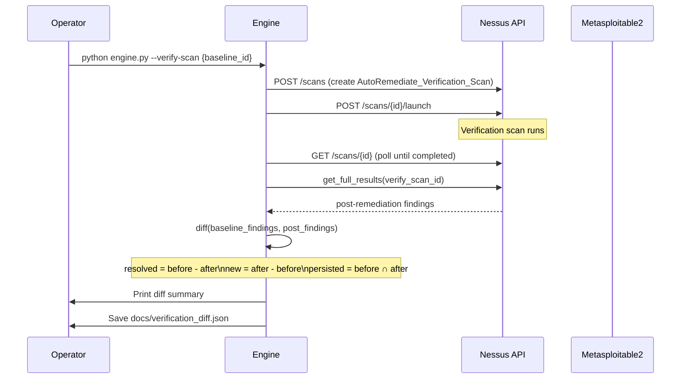
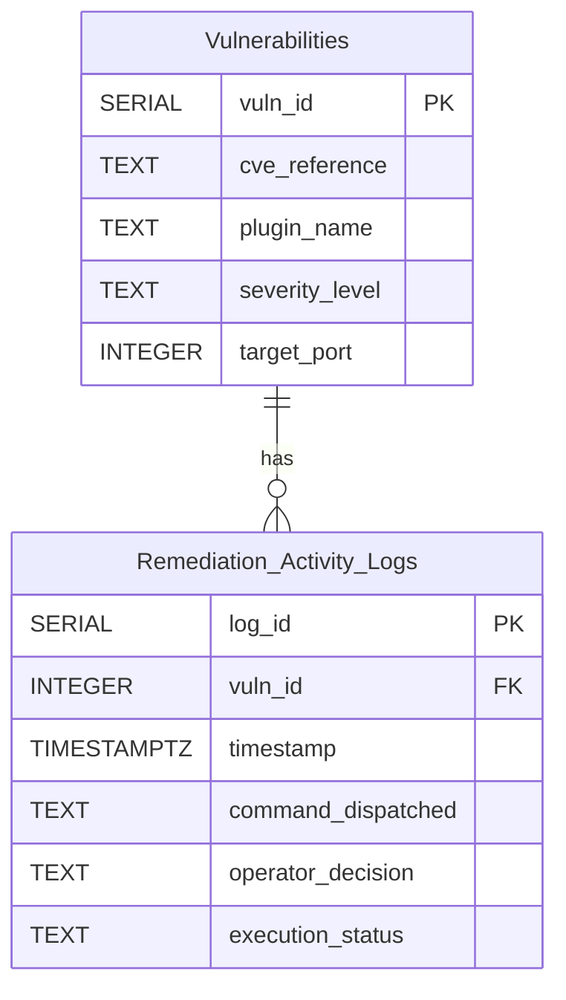

# System Analysis & Design — AutoRemediate AI

**Project 7: Autonomous Vulnerability Remediation Plan & Incident Response Hub**  
**Team 3 | DEPI Capstone | Evaluator: Eng. Ahmed Attia**

---

## 1. Use-Case Diagram



---

## 2. Architecture Diagram (Four Layers)



---

## 3. Data-Flow Diagram

```mermaid
%%{init: {'theme': 'default'}}%%
sequenceDiagram
    participant Op as Operator
    participant Eng as Engine
    participant Nes as Nessus API
    participant Par as Parser
    participant Rec as Recommender
    participant Rem as Remediator
    participant DB as Supabase DB

    Op->>Eng: python engine.py --launch-scan
    Eng->>Nes: POST /scans (create Basic Network Scan)
    Nes-->>Eng: scan_id
    Eng->>Nes: POST /scans/{id}/launch
    Note over Nes: Scan runs 15–40 min

    Op->>Eng: python engine.py --run --scan-id {id}
    Eng->>Nes: GET /scans/{id} (poll until completed)
    Eng->>Nes: GET /scans/{id}/hosts/{host_id}/plugins/{plugin_id}
    Nes-->>Eng: full plugin details JSON
    Eng->>Par: parse_full_results(raw)
    Par-->>Eng: findings[]

    Eng->>Rec: prioritise_and_recommend(findings)
    Rec-->>Eng: scored + sorted findings[]

    loop For each Critical/High finding
        Eng->>Op: Display Decision Card
        Op->>Eng: [A] Approve / [2] Alt / [R] Reject / [Q] Quit
        alt Approved
            Eng->>Rem: execute(finding, action)
            Rem->>Rem: SSH → sudo service X stop
            Rem->>Rem: verify_on_target() + verify_external()
            Rem-->>Eng: {status: Success/Failed/Retrying}
        else Rejected
            Note over Eng: status = Skipped
        end
        Eng->>DB: insert_vulnerability() + insert_remediation_log()
    end

    Eng->>Op: Final Summary (success/failed/skipped counts)
```

---

## 4. Sequence Diagram — Post-Remediation Verification



---

## 5. Entity-Relationship Diagram



---

## 6. Priority Scoring Formula

| Factor | Points |
|--------|--------|
| Critical severity | +100 |
| High severity | +70 |
| Medium severity | +40 |
| Low severity | +10 |
| Known backdoor / Metasploit module | +40 |
| Public PoC (not weaponised) | +20 |
| No authentication required | +15 |
| Port confirmed listening | +15 |
| **Max possible** | **170** |

Tie-break: lower port number first; then CVE lexicographic descending.

---

## 7. Preference Ladder

| Rung | Action | Command Pattern | SSH Exception |
|------|--------|-----------------|---------------|
| 1 | Patch/upgrade | `apt-get install --only-upgrade` | N/A (infeasible) |
| 2 | Stop service | `sudo service <name> stop` | **NEVER for port 22** |
| 3 | Harden | config edits + service restart | Default for SSH |
| 4 | iptables DROP | `sudo iptables -I INPUT -p tcp --dport <port> -j DROP` | **NEVER port 22** |
| 5 | Monitor only | *(no command)* | Always available |
